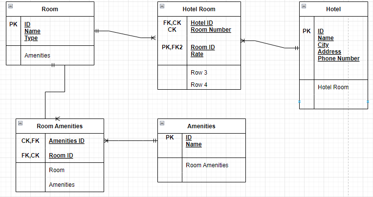

# Hotel Management System

## Problem Domain
Today will the be the beginning of a multi-lab project where you will build out the API server for a Hotel Asset Management system.

## Async Inn

## A project by Laith ALalamat

## Wednesday 13/4/2022

- ### Hotel Table
The Hotel must have a name and ID and a location and a phone number all of them are primary keys since they must be unique for each location.

The relation between the Hotel and the Hotel Room is One-Many since one hotel can have many hotel rooms.

- ### Hotel Room
The Hotel Room must have an ID and a number and they are foreign and composite keys since they depend on the location of the hotel and on the type of the Room.

It should also have the hotel ID as a foreign key.

The relation between the hotel room and the room is Many-One since the hotel room can consist of Many rooms

- ### Room
The Room has an ID and a Name and a Type and all of them are primary keys since each room is unique.

The relation between the Room and Room Amenities is One-Many since many room amenities can be in one room

- ### Room Amenities

The Room Amenities has the Amenities ID as Foreign key as it is unique and a Room ID as a composite key between the Room and the Amenities

The relation between the Room Amenities and the Amenities is Many-One since many amenities can be in a room amenity

- ### Amenities

The Amenities has and ID and Name as a primary key because each one must be unique than the other